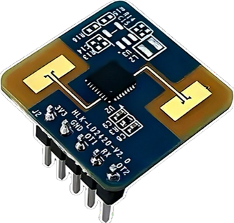

# LD2420GeoGab


Arduino/PlatformIO library for the **HLK-LD2420** 24 GHz mmWave presence and motion radar sensor by Shenzhen Hi-Link Electronic Co.

> **Status:** V1.0.0 Released, but not yet thoroughly tested.

---

## The Sensor

### What is the HLK-LD2420?

The HLK-LD2420 is a compact 24 GHz FMCW (Frequency Modulated Continuous Wave) millimetre-wave radar module made by Shenzhen Hi-Link Electronic Co., Ltd. At its core is a **Hylink S3 series** single-chip mmWave SoC that integrates the RF transceiver, ADC, and DSP — along with a host MCU running Hi-Link's proprietary human-sensing firmware.



Unlike a PIR sensor, the LD2420 detects both **active movement** and near-stationary **micro-motion** (breathing, small hand gestures) — it does not rely on heat or infrared light and is completely unaffected by ambient temperature, lighting or humidity. The radar wave also penetrates most non-metallic enclosures, so the module can be hidden inside a device without any opening.

The sensor provides only a **1D distance** output — it detects presence in a radial zone and reports which gate (70 cm slice) the target is in. It has no angular resolution and cannot distinguish multiple targets or tell you where in the room someone is. For X/Y coordinate tracking across multiple targets, look at the LD2450 instead.

---

### Technical Specifications

| Parameter                  | Value                              |
|----------------------------|------------------------------------|
| Frequency band             | 24 GHz ISM (24.000–24.250 GHz)     |
| Radar type                 | FMCW, 1 TX / 1 RX antenna          |
| SoC                        | Hylink S3 series                   |
| Supply voltage             | 3.3 V (3.0 V – 3.6 V)             |
| Supply current (avg.)      | 50 mA                              |
| Detection range            | 0.2 m – 8 m                        |
| Distance resolution        | 70 cm per gate (16 gates total)    |
| Detection angle            | ±60° (horizontal and vertical)     |
| Refresh rate               | ~10 Hz (Energy / Simple mode)      |
| Operating temperature      | −40 °C – +85 °C                    |
| Module dimensions          | 20 mm × 20 mm × 1.2 mm             |
| Pin connector pitch        | 2.54 mm                            |
| Interface                  | UART + GPIO (OT pin)               |
| Debug interface            | SWD (J1, firmware flashing only)   |
| Regulatory approvals       | FCC, CE, SRRC                      |
| Baud rate (fw ≥ v1.5.3)    | 115200                             |
| Baud rate (fw < v1.5.3)    | 256000                             |

---

### Pinout

The module has two connectors, both with 2.54 mm pin spacing. **Pins are not soldered by default** — you need to solder a 5-pin header to J2 yourself.

**J2 — Main connector (power + UART)**

```
J2 Pin │ Label │ Description
───────┼───────┼──────────────────────────────────────
  1    │ VCC   │ 3.3 V supply (3.0 – 3.6 V)
  2    │ GND   │ Ground
  3    │ TX    │ Sensor UART TX → connect to ESP32 RX
  4    │ RX    │ Sensor UART RX → connect to ESP32 TX
  5    │ OT    │ GPIO output: HIGH when target present
```

> The **OT pin** is a simple digital output — HIGH when the sensor is reporting presence, LOW when not. Useful for hardware interrupts or simple integrations that don't need UART.

**J1 — SWD interface (debug / firmware flashing)**

```
J1 Pin │ Label │ Description
───────┼───────┼──────────────────────────────────────
  1    │ GND   │ Ground
  2    │ CLK   │ SWD clock
  3    │ DATA  │ SWD data
  4    │ RST   │ Reset
```

> J1 is used for MCU firmware burning and debugging with Hi-Link's own tools. Not needed for normal use.

---

### Sensor Orientation

The LD2420 has a defined coordinate system that matters for installation:

```
        Y (up)
        │
        │
        └──── X (horizontal)
       /
      Z (into detection area)
```

- **Z-axis** points into the detection area — mount so this faces the room.
- **Y-axis** points upward in wall mounting.
- The sensor detects along the Z-axis; gates measure distance along Z.

---

### Installation & Mounting

The LD2420 supports both ceiling and wall mounting. **Ceiling mounting is recommended** for best coverage, but wall mounting achieves the longer rated 8 m range.

#### Ceiling mounting

- Recommended height: **2.7 – 3.0 m**
- Detection pattern: a downward-facing **cone** covering a circular area below the sensor
- At 2.7 m height with factory defaults:
  - Motion detection radius: ~5 m
  - Micro-motion (still person) radius: ~4 m
- Z-axis points straight down

#### Wall mounting

- Recommended height: **1.5 – 2.0 m**
- Detection pattern: a horizontal **sector**, ±45° in both horizontal and pitch directions
- At 1.5 m wall height with factory defaults:
  - Motion sensing range: **up to 8 m**
  - Micro-motion (still person) range: up to 6 m
  - Horizontal coverage: ±45° (90° total arc)

#### Detection zone vs. gate range

Whatever the mounting style, the active detection range is determined by `roiMin` and `roiMax` (configurable with `setGateRange()`). Gates closer than `roiMin` or farther than `roiMax` are completely ignored — they contribute no false triggers even if objects are present there.

---

### Typical Applications

- **Smart lighting** — turn lights on when someone enters, off after they leave, even if they're sitting still
- **HVAC / climate control** — only heat or cool a room that is actually occupied
- **Security** — presence alarm that cannot be fooled by a still person holding their breath
- **Energy management** — power down screens, standby devices, or office equipment when a room empties
- **Sleep monitoring** — detect breathing / micro-motion of a sleeping person (ceiling mount)
- **Meeting room occupancy** — detect whether a room is in use without cameras

---

### Hi-Link mmWave Sensor Comparison

| Model     | Size (mm)   | Range  | Angle  | Antennas | Special feature                      | Best for                          |
|-----------|-------------|--------|--------|----------|--------------------------------------|-----------------------------------|
| LD2410    | 37×22       | 6 m    | ±60°   | 1T1R     | —                                    | Basic presence, wide community    |
| LD2410B   | 37×22       | 6 m    | ±60°   | 1T1R     | Bluetooth config via app             | DIY with easy phone tuning        |
| LD2410C   | 37×22       | 6 m    | ±60°   | 1T1R     | 2.54 mm header (breadboard friendly) | Prototyping                       |
| LD2410S   | —           | —      | ±60°   | 1T1R     | µA sleep current, battery powered    | Battery devices                   |
| **LD2420**| **20×20**   | **8 m**| **±60°**| **1T1R**| **Smallest module, 3.3 V native, ABD algorithm** | **Compact builds, longest range** |
| LD2412    | —           | 9 m    | ±75°   | 1T1R     | Wider angle, BLE, noise learning     | High-precision long range         |
| LD2450    | 37×22       | ~6 m   | ±60°   | 1T2R     | X/Y coordinates, up to 3 targets     | Multi-person position tracking    |
| LD2461    | —           | 6 m    | —      | —        | Up to 5 persons + direction          | People counting                   |

**Why choose the LD2420 over the LD2410 series?**
- Smaller PCB footprint (20×20 mm vs 37×22 mm)
- Longer rated range (8 m vs 6 m)
- Natively 3.3 V — no level shifting required with ESP32
- ABD algorithm with per-gate 32-bit thresholds (finer calibration than LD2410's 16-bit registers)

**Why choose the LD2410 series over the LD2420?**
- Much larger community, more examples, better ESPHome/Home Assistant integration
- Bluetooth on LD2410B for in-app tuning without writing code
- LD2412 has wider angle (±75°) and automatic noise floor learning

---

### Installation Tips

- **Radar penetrates plastic, wood, drywall and glass** — the sensor can be hidden inside a device. Metal blocks or reflects radar, so avoid metal enclosures.
- **Protect the back side** — radar waves penetrate the PCB in both directions. Moving objects behind the sensor (e.g. in the next room) can cause false triggers. Use a small metal plate or shield on the back if needed.
- **No dead zone below 20 cm** — unlike some sensors the LD2420 detects presence starting at 0.2 m (gate 0). Gate 0 itself is best excluded (`minGate=1`) because the sensor's own PCB reflections tend to be detected there.
- **Avoid pointing two 24 GHz radars directly at each other** — interference is possible. Angling them 45° or more apart avoids this.
- **Avoid large vibrating surfaces** in the detection zone (fans, washing machines, swinging doors) — they produce continuous energy that can prevent the "gone" state from ever being reached. Use `roiMax` to exclude far gates or raise lowThresh for the affected gates.
- **Let the sensor settle** — after power-on, the ABD algorithm takes a few seconds to establish its background noise floor. Avoid walking through the detection zone immediately after boot.

---

## Features

- Full binary UART protocol implementation (verified on fw **v1.6.1**)
- **Energy mode** — per-gate signal energies + distance + detection status
- **Simple mode** — lightweight ASCII ON/OFF/Range output
- **Debug mode** — raw Doppler × Range matrix (20 × 16 × 4 bytes, continuous)
- Full **ABD parameter** read/write (sole active config path on fw v1.6.1)
- **Callback API** — presence transitions, distance, status, energy frames, debug frames
- **Poll API** — `isPresent()`, `getLastDistance()`, `getLastStatus()` without callbacks
- Gate distance helpers — `gateStartCm()`, `gateCentreCm()`, `distanceToGate()`
- Compile-time debug logging with ANSI colour output (`GG_DEBUG 0/1/2`)
- ESP32 and ESP32-S3 pin defaults with auto-detection

---

## Hardware

| Sensor pin | Connect to          |
|------------|---------------------|
| VCC        | 3.3 V               |
| GND        | GND                 |
| RX         | ESP32 TX (`GG_TXPIN`) |
| TX         | ESP32 RX (`GG_RXPIN`) |

Default pins:

| Board     | TX (→ sensor RX) | RX (← sensor TX) |
|-----------|------------------|------------------|
| ESP32     | GPIO 27          | GPIO 26          |
| ESP32-S3  | GPIO 17          | GPIO 18          |

---

## Quick Start

```cpp
#include <LD2420GeoGab.h>

LD2420GeoGab radar;

void setup() {
    Serial.begin(115200);

    if (!radar.begin()) {
        Serial.println("Sensor not found!");
        while (true);
    }

    radar.activateConfigMode();
    radar.setSystemMode(LD2420SystemMode::Energy);
    radar.setGateRange(1, 8, 30);   // 70 cm – 630 cm, 30 s hold-off
    radar.deactivateConfigMode();

    // Callback style — fires only on state change:
    radar.setPresenceCallback([](bool present) {
        Serial.println(present ? "Present" : "Gone");
    });
}

void loop() {
    radar.update();

    // Poll style — check cached values at any time:
    if (radar.isPresent())
        Serial.println(radar.getLastDistance());
}
```

---

## Configuration

All settings can be overridden before `#include <LD2420GeoGab.h>` or via `build_flags` in `platformio.ini`:

```ini
build_flags =
    -DGG_TXPIN=17
    -DGG_RXPIN=18
    -DGG_BAUDRATE=115200
    -DGG_DEBUG=1
```

| Define          | Default (ESP32) | Description                                      |
|-----------------|-----------------|--------------------------------------------------|
| `GG_UART_NUM`   | `2`             | UART port: 1 = Serial1, 2 = Serial2              |
| `GG_TXPIN`      | `27`            | ESP32 TX → sensor RX                             |
| `GG_RXPIN`      | `26`            | ESP32 RX ← sensor TX                             |
| `GG_BAUDRATE`   | `115200`        | fw ≥ v1.5.3: 115200 — older fw: 256000           |
| `GG_DEBUG`      | `0`             | 0 = silent, 1 = info, 2 = verbose + hex dump     |
| `GG_DEBUG_SERIAL` | `Serial`      | Output target for debug messages                 |

---

## Detection Zones

Each of the 16 gates covers **70 cm**. Gate 0 (0–70 cm) typically produces false triggers from the sensor's own PCB — exclude it with `minGate = 1`.

```
Gate  0 =    0 –   70 cm  ← near-field, exclude with minGate=1
Gate  1 =   70 –  140 cm
Gate  5 =  350 –  420 cm
Gate  8 =  560 –  630 cm
Gate 11 =  770 –  840 cm  ← practical wall-mount motion limit (~8 m)
Gate 15 = 1050 – 1120 cm  ← theoretical max
```

Practical limits (per HI-Link manual):

| Mounting   | Motion    | Presence (micro-motion) |
|------------|-----------|-------------------------|
| Wall       | ≤ 8 m (gate 11) | ≤ 6 m (gate 8)   |
| Ceiling    | ≤ 5 m (gate 7)  | ≤ 4 m (gate 5)   |

---

## System Modes

| Mode    | Value  | Output                         | Notes                             |
|---------|--------|--------------------------------|-----------------------------------|
| Energy  | 0x0004 | Binary gate-energy frames      | **Recommended** — fw ≥ v1.5.4    |
| Simple  | 0x0064 | ASCII text ON/OFF/Range        | Low bandwidth                     |
| Debug   | 0x0000 | Raw Doppler × Range matrix     | Continuous, high volume           |
| MTT/VS/GR | 1/2/3| ASCII text (same as Simple)   | LD2450 features, not in LD2420    |

---

## API Reference

### Lifecycle

```cpp
bool begin(int txPin = GG_TXPIN, int rxPin = GG_RXPIN, uint32_t baudRate = GG_BAUDRATE);
void update();                          // call in loop()
void setUpdateInterval(unsigned long ms);
```

### Config Mode

```cpp
LD2420Error activateConfigMode();
LD2420Error deactivateConfigMode();
bool        isInConfigMode() const;
```

### Firmware Info

```cpp
const LD2420FirmwareVersion& getFirmwareVersion() const;
// .versionStr  → "v1.6.1"
// .major/.minor/.patch → 1, 6, 1
```

### Poll Getters

```cpp
LD2420DetectionStatus getLastStatus()    const;  // None / Motion / Presence
uint16_t              getLastDistance()  const;  // cm, 0 if unknown
bool                  isPresent()        const;  // true if Motion or Presence
bool                  newDataAvailable();         // true once per new frame (self-clearing)
uint32_t              getFrameCount()    const;  // total frames parsed since begin()
```

`newDataAvailable()` is self-clearing — it returns `true` once per new frame, then `false` until the next frame arrives. Use it to avoid printing stale values without a separate `millis()` throttle:

```cpp
void loop() {
    radar.update();
    if (radar.newDataAvailable()) {
        Serial.println(radar.getLastDistance());
    }
}
```

`getFrameCount()` lets you detect missed frames or measure the effective frame rate:

```cpp
static uint32_t lastCount = 0;
uint32_t count = radar.getFrameCount();
if (count != lastCount) {
    Serial.printf("frames: %lu  missed: %lu\n", count, count - lastCount - 1);
    lastCount = count;
}
```

### High-Level Configuration

```cpp
// All require activateConfigMode() first
LD2420Error setSystemMode(LD2420SystemMode mode);
LD2420Error getSystemMode(LD2420SystemMode &outMode);
LD2420Error setGateRange(uint8_t minGate, uint8_t maxGate, uint16_t timeoutSec);
LD2420Error getGateRange(uint16_t &outMin, uint16_t &outMax, uint16_t &outTimeout);
LD2420Error setGateABDHighThreshold(uint8_t gate, uint32_t value);
LD2420Error setGateABDLowThreshold(uint8_t gate, uint32_t value);
LD2420Error readABDConfig(LD2420ABDConfig &outConfig);
LD2420Error writeABDConfig(const LD2420ABDConfig &config);
```

### Callbacks

```cpp
void setPresenceCallback(LD2420PresenceCb cb);  // void(bool present) — on transition only
void setDistanceCallback(LD2420DistanceCb cb);  // void(uint16_t cm)  — every frame
void setStatusCallback  (LD2420StatusCb   cb);  // void(LD2420DetectionStatus) — every frame
void setEnergyCallback  (LD2420EnergyCb   cb);  // void(const LD2420EnergyFrame&)
void setDebugCallback   (LD2420DebugCb    cb);  // void(const LD2420DebugFrame&)
```

### Gate Distance Helpers (global, no class prefix)

```cpp
uint16_t gateStartCm(uint8_t gate);         // near edge of gate in cm
uint16_t gateCentreCm(uint8_t gate);        // centre of gate in cm
uint8_t  distanceToGate(uint16_t distCm);   // which gate covers this distance
```

---

## Motion vs. Presence

The LD2420 reports three detection states via `LD2420DetectionStatus`:

| State      | Value | Meaning                                                              |
|------------|-------|----------------------------------------------------------------------|
| `None`     | 0     | No target detected in the active gate range                          |
| `Motion`   | 1     | Active movement — gate energy exceeds `highThresh`                   |
| `Presence` | 2     | Still person — gate energy exceeds `lowThresh` (maintained after Motion) |

This is the LD2420's equivalent of the **Moving / Static** distinction found on the LD2410 series — just with different naming.

### Key differences from the LD2410
- The LD2410 has separate "moving target" and "stationary target" detection running in parallel — both can be active simultaneously and both have their own distance output.
- The LD2420 uses a **sequential model**: Motion is detected first (energy > `highThresh`), then the sensor maintains Presence as long as energy stays above `lowThresh`. Only one state is active at a time.
- The LD2420 has **no angle information** and cannot track multiple targets. The LD2450 should be used if X/Y coordinates or multi-target detection are required.

### In Simple mode
- `ON` maps to `Presence` — someone is present (may be still or moving)
- `Range XXXX` maps to `Motion` — active movement, XXXX = distance in cm
- `OFF` maps to `None`

Note: in Simple mode the sensor only outputs a distance when it reports `Motion` (`Range XXXX`). A still person (`ON`) produces no distance value — use Energy mode if you need continuous distance updates regardless of movement state.

---

## Threshold Tuning

### Motion (highThresh)
Sensor reports **Motion** when gate energy exceeds `highThresh`.
Rule of thumb: **≥ 5× background noise** for that gate.

### Presence (lowThresh)
Sensor reports **Presence** when gate energy exceeds `lowThresh` after Motion.
Rule of thumb: **2–5× background noise**. Must always be < `highThresh`.

Factory defaults are in `LD2420_FACTORY_MOVE_THRESH[]` and `LD2420_FACTORY_STILL_THRESH[]`.

To observe background noise, put the sensor in Energy mode with nobody in the room and log `frame.gateEnergy[]` for a few seconds.

---

## Auto-Calibration

Manual threshold tuning requires measuring the background noise floor per gate and calculating appropriate values — a tedious process. `startAutoCalibration()` automates this by collecting live Energy frames from an empty room and computing new thresholds from the measured average gate energies.

### How it works

1. Waits `delayMs` milliseconds — time for the person to leave the detection zone.
2. Temporarily switches to Energy mode (the current mode is restored afterwards).
3. Suppresses all user callbacks to avoid spurious events during measurement.
4. Collects `frames` Energy frames and accumulates per-gate signal energies.
5. Computes new thresholds from the per-gate averages:
   - `highThresh[g] = avg[g] × 5.0` — motion trigger (≥ 5× noise floor per HI-Link spec)
   - `lowThresh[g]  = avg[g] × 2.0` — presence maintain (2× noise floor)
6. Writes the new thresholds via `writeABDConfig()` — existing `roiMin`, `roiMax` and `delayTime` are preserved.
7. Restores original mode, callbacks and update interval.
8. Fires `setCalibrationCompleteCallback()` with the computed config.

The multiplier constants `LD2420_CALIB_HIGH_FACTOR` (5.0) and `LD2420_CALIB_LOW_FACTOR` (2.0) are defined in `LD2420GeoGab_ConTyp.h`.

### Blocking mode (setup / single-shot)

The simplest approach — call from `setup()` and wait until calibration is done before continuing:

```cpp
void setup() {
    radar.begin();

    // Blocking: waits 5 s for the room to empty, then collects 100 frames (~10 s).
    // Function does not return until calibration is complete.
    radar.startAutoCalibration(100, 5000, /*blocking=*/true);

    Serial.println("Calibration done — entering detection mode.");
}
```

### Non-blocking mode (runtime / async)

Use this when you want calibration to run in the background without freezing your application. Register a callback to know when it is done:

```cpp
void setup() {
    radar.begin();

    radar.setCalibrationCompleteCallback([](bool success, const LD2420ABDConfig &cfg) {
        if (success) {
            Serial.println("Calibration complete!");
            for (uint8_t g = 0; g < LD2420_TOTAL_GATES; g++)
                Serial.printf("  Gate %2u: high=%lu  low=%lu\n",
                              g, cfg.highThresh[g], cfg.lowThresh[g]);
        } else {
            Serial.println("Calibration was cancelled.");
        }
    });

    // Non-blocking: returns immediately, runs inside update().
    radar.startAutoCalibration(100, 5000, /*blocking=*/false);
}

void loop() {
    radar.update();   // drives the calibration internally
}
```

To cancel a running calibration at any time:

```cpp
radar.cancelAutoCalibration();
// → fires the callback with success=false
```

### Gate 0

Gate 0 (0–70 cm) is excluded from calibration by default (`skipGate0 = true`) because the sensor's own PCB generates strong near-field reflections that make the measured energy in gate 0 unreliable as a baseline. Factory default thresholds are used for gate 0 instead.

If your sensor is ceiling-mounted at a height where nothing is within 70 cm, you can include gate 0:

```cpp
radar.startAutoCalibration(100, 5000, false, /*skipGate0=*/false);
```

### Important: the room must be empty

The sensor measures the **background noise floor** — any person or moving object in the detection zone during calibration will inflate the measured energy and produce thresholds that are too high. The sensor may then fail to detect presence reliably afterwards.

> If calibration produces unexpectedly high thresholds, re-run it with nobody in the room.

---

## Protocol Notes (fw v1.6.1)

| Observation | Detail |
|---|---|
| Register write CMD 0x0001 | Returns error 0x0001 — **not writable** |
| Register read CMD 0x0002 | Works but values **not synced** with ABD |
| ABD write CMD 0x0007 | ✅ **Sole active config write path** |
| ABD read CMD 0x0008 | ✅ Works |
| Serial number CMD 0x0011 | ❌ Not implemented — always times out |
| System mode CMD 0x0012 | ✅ Works |
| MTT / VS / GR modes | Behave identically to Simple mode |
| Debug mode | Runs **continuously** — no auto-revert |
| ACTIVATE_CONFIG | Requires **double-send** with 100 ms flush |

---

## Examples

| Example | Format | Demonstrates |
|---|---|---|
| `SimpleCallback` | PlatformIO + Arduino | Simple mode, presence & distance callbacks, minimal getting-started sketch |
| `SimpleLoop` | PlatformIO + Arduino | Simple mode, poll style (`isPresent()` / `getLastDistance()`), no callbacks |
| `Energy` | PlatformIO + Arduino | Energy mode, all callbacks, per-gate energy output, gate configuration |
| `Debug` | PlatformIO + Arduino | Debug mode, raw RDMap output via `setDebugCallback`, note on frame size |

Each example is provided in two formats:
- `examples/<Name>/platformio/` — `src/main.cpp` + dedicated `platformio.ini`
- `examples/<Name>/arduino/` — `<Name>.ino` + `config.h`

---

## Update History

### v1.0.1 — 2026-05-07
- **Energy mode: poll getter added** — `getLastEnergyFrame()` returns a `const LD2420EnergyFrame&` with the full gate energy array, distance and detection status from the most recently parsed Energy frame. Allows Energy mode to be used in the same polling style as `getLastDistance()` / `getLastStatus()` without requiring a callback.
  - `LD2420GeoGab.h` — added `LD2420EnergyFrame lastEnergyFrame` to the private `values` struct and the public getter `const LD2420EnergyFrame& getLastEnergyFrame() const`
  - `LD2420GeoGab.cpp` — `values.lastEnergyFrame` is now assigned inside `processRxBuffer()` after every successful `parseEnergyFrame()` call

### v1.0.0 — 2026-03
- Initial release

---

## License

MIT see [LICENSE](LICENSE) file in the library root.


<div align="middle" >
  <br>
  <span>Gabriel Sieben 2026</span>
</div>
